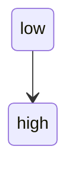
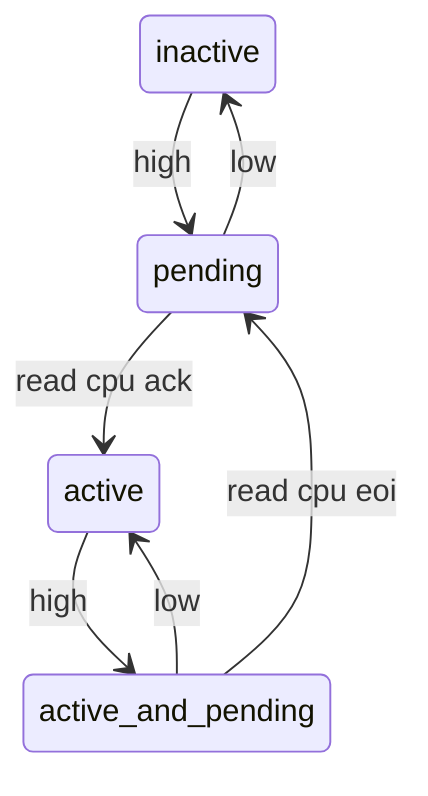
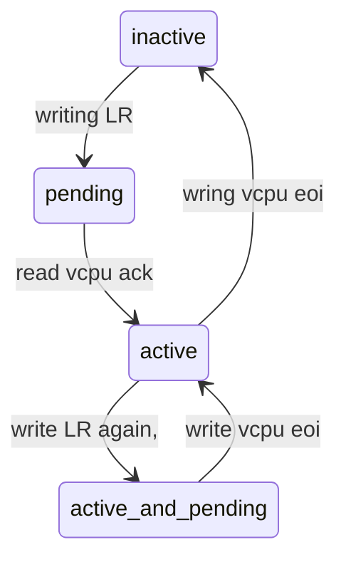
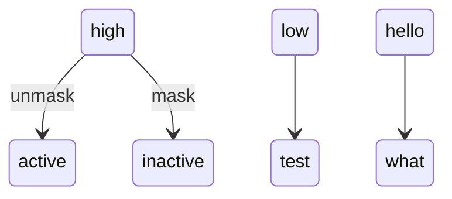
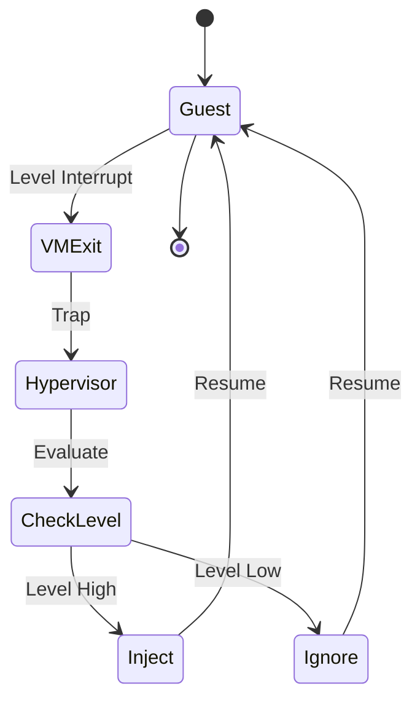

The state of a GPIO  pin ,active high level triggered
	GPIO 

GIC 

VGIC 

GPIO 

i have to use a way to throttle it ,the cpu goes to isr, it then polls 
it, in this situation we should unmask it, if it goes isr, we set it to pending,
then

