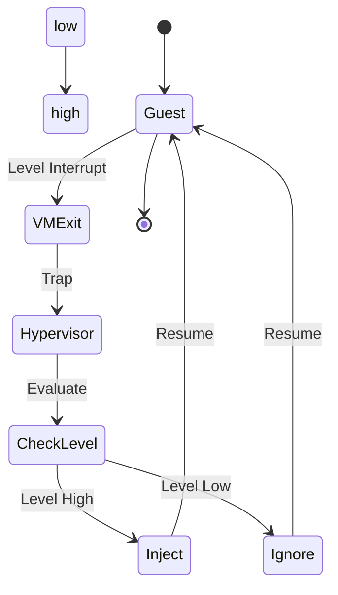

The state of a GPIO  pin ,active high level triggered
	GPIO 

GIC 
```mermaid 
	inactive-->pending:high
	pending-->active:read cpu ack
	active-->active and pending:high 
	active and pending-->pending :read cpu eoi 
	active and pending-->active :low
	pending-->inactive:low 
```
VGIC 
```
	inactive-->pending:writing LR
	pending-->active:read vcpu ack
	active-->active and pending: write LR again,
	active-->inactive : wring vcpu eoi
	active and pending --> active : write vcpu eoi
		
```
i have to use a way to throttle it ,the cpu goes to isr, it then polls 
it, in this situation we should unmask it, if it goes isr, we set it to pending,
then

