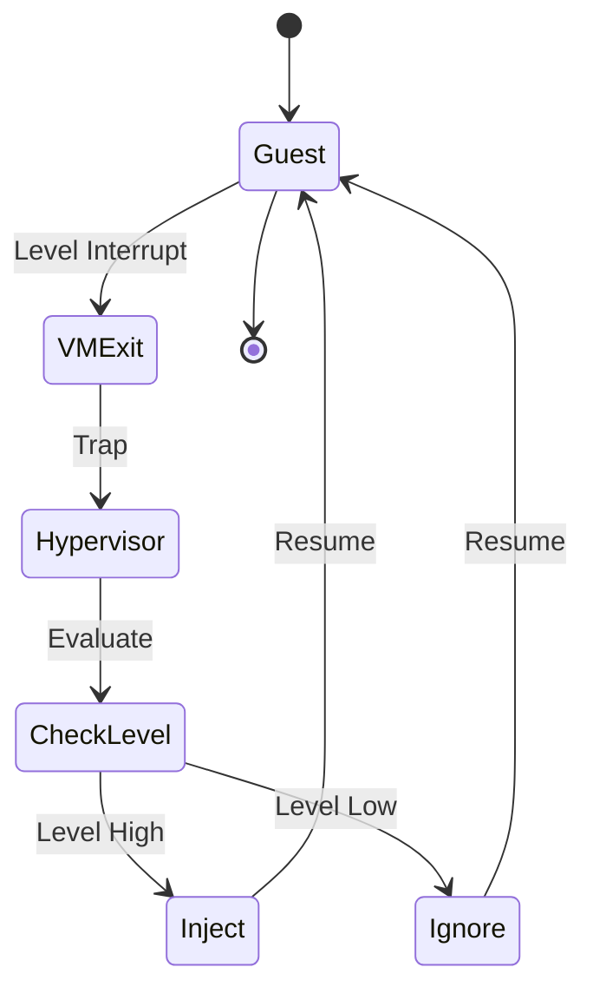

```mermaid
stateDiagram-v2
    [*] --> Guest
    Guest --> VMExit: Level Interrupt
    VMExit --> Hypervisor: Trap
    Hypervisor --> CheckLevel: Evaluate
    CheckLevel --> Inject: Level High
    CheckLevel --> Ignore: Level Low
    Inject --> Guest: Resume
    Ignore --> Guest: Resume
    Guest --> [*]
```
